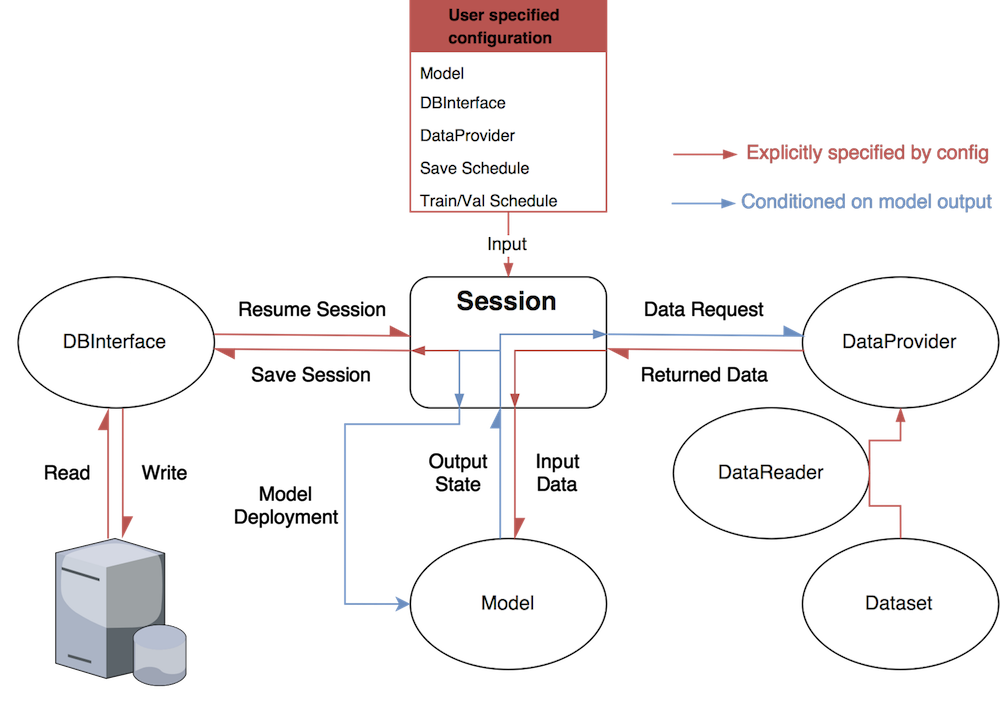

# PTUtils
[](https://github.com/alexandonian/ptutils/blob/master)
[](https://travis-ci.org/alexandonian/ptutils)
[](https://github.com/alexandonian/ptutils/blob/master/LICENSE.txt)
[](https://github.com/alexandonian/ptutils/blob/master)
[](https://github.com/alexandonian/ptutils/blob/master)

PyTorch utilities for neural network research.


## You have just found PTUtils.
PTUtils is a PyTorch utility package designed for coordinating neural network experiments with dynamics and modularity in mind. Inspired by its Tensorflow sibling, [tfutils](https://github.com/neuroailab/tfutils), PTUtils provides functionality for:

- constructing, runing and monitoring dynamic neural network models
- retrieving data from multiple data sources 'on the fly'
- interfacing with common databases

Read the documentation at [PTUils.io](https://github.com/alexandonian/ptutils).

PTUtils is compatible with: __Python 2.7__.

------------------

### Guiding Design Principles
A number of important requirement emerged out of the tfutils' redesign:

* __Simplicity:__  PTUtils supports a streamlined API and reduces the relience on specific conventions requrired to specify and run an experiment by enforcing an extremely concise set of rules on a single base class.

* __Modularity:__ PTUtils increases fine-grain control over an experiment by generating a library of small, independent and *compatible* units of functionality from the same base class.

* __Flexibility:__ expand set of possible usage patterns by specifying experiments in terms of the composition of customized functional units.

* __Extensibility:__ PTUtils provides more opportunities for custom behavior by allowing users to override the default functionality of any given unit without disrupting the others.

**Acknowledgments:** PTUtils' design was inspired from numerous sources/frameworks:

| General  | Tensorflow | PyTorch          | Misc.      |
| :------- |:---------  | :--------------- | :-----     |
| Keras    | TFUtils    | Torch.utils      | Django     |
| Teras    | TFLearn    | pytorch-examples | Flask      |
| Kur      | TF-Slim    | pytorch-tutorial | Requests   |
| Chainer  | Sonnet     | TorchNet         | Jsonpickle |
| Neon     | Polyaxon   | TorchSample      | Datastore  |
| Py2Learn | Baselines  | Inferno          | Scrapy     |

### Creating dynamic experiments
The 'define-by-run' paradigm established by deep learning frameworks such as Chainer, DyNet, PyTorch offers a powerful new way to structure neural network computations: the execution of the model/graph is conditioned on the state of the model itself, forming a *dynamic graph*. PTUtils attempts to **leverage and extend PyTorch's dynamic nature** by giving researchers a fully *dynamic experiment* whereby execution of the entire experiment is conditioned on the state of the experiment and any component contained within. The long-term motivation behind this approach is to provide researchers with a dynamic environment in which they can control the behavior/interactions of/between a model/collection of models as well as the data that is presented to the models, while saving the evolution of the environment behind the scenes. 


---

## The PTUtils `Module`

At the core of PTUtils is the `Module`class, the base class for all ptutils objects that shamelessly attempts to generalize PyTorch's existing `torch.nn.Module`. A `Module` is an arbitrary, container-like object that fulfills three simple requirements:

1. All `Module` subclasses must either be __callable__ or contain a primary callable attribute. In other words, all modules must perform an action.

2. All `Module` subclasses must implement a `state_dict()` (potential alias: `state()`) method that returns an object (likely a dict) that reflects the *state* of the module at the time `state_dict()` was called. What constitues a module's '*state*' can be completely specified by the user, although PTUtils offers concrete and sensible options.

3. All `Module` subclasses must implement a `load_state_dict()` (potential alias: `load_state()`) method that accepts the object returned by that module's `state_dict()` method and restores that module to the state it was in when `state_dict()` was called.

### \*\* *Primary question* \*\*: the core functionality of every component of PTUtils? 

Is it enough to just enfore that each Module is able to convert to and from a 'serialized' version of itself, or should it also be able to save/load/restore itself. How decoupled/composable should each module be (i.e. should each module expose a single, primary method limiting it

An example: Suppose you have `Model` class that contains a network, loss function/criterion and optimizer. Should the Model be able to train/test itself via `Model.train() and Model.test()`, or should there exist a separate`Trainer` module which accepts one or several models and orchestrates the training process (essentially decoupling the model from the training process).

Enforcing this simple API attempts to address the notion that the environment in which a neural network operates should be free to evolve dynamically just as the network itself is. 

---

## A `Module`'s `MetaModule`

Each `Module` should be paired with one or several `MetaModule`s that specify exactly how a certain module should be configured, created, handled, saved/restored, etc. Here you might specify which modules should be saved/restored, where they should be stored, how frequently they are stored, whether they should be cached, and the actual structure of the saved representation.

Critically, all metamodules are __'self-serializing'__, meaning they can generate serialized versions of themselves to be stored in a Database. Furthermore, metamodules are able to recognize, encode/decode, and read/write various file formats (.json, .yaml, .pkl, .npz, .tfrecords, .HDF5, .lmdb, etc.)

The `MetaModule` was inspired by the Djano Meta class which is nested within its core db Model. The primary MetaModules are:

#### The `State` metamodule.
The `State` metamodule is the 'identity' module (essentially an enhanced python dictionary with support for 'dot' notation and instrospective features such as recognizing submodules). A primary use of the state may be to contain a serializable version of a Model's weights.

```python
model_state = State('/path/to/previously/saved/model/weights')
model.from_meta(state=model_state)`
```

An instance `s` of the `State` class preserves the following:

```python
    s = s(*args, **kwargs) = s.state_dict(*args, **kwargs) = s.load_state_dict(*args, **kwargs).
```

Calling a state object or its two state_dict with any arguments will always return the original state object unmodified.

#### The `Configuration` metamodule.
The `Configuration` metamodule is a serializable representation of the structure of a module. The Module can costruct itself via a configuration. This would be the primary interface for constructing a new experiment.

```python
dbconfig = {db_name='db_name',
            collection_name='collection_name',
            hostname='hostname',
            port='port'}

dbinterface.from_meta(config=dbconfig)
```

### The `Status` metamodule.
The `Status` metamodule represents transient, instance properties pertaining to the status of a module, e.g. whether or not it has a valid configuration and is ready to be used, whether it is newly initialized or restored, whether it was 'succesful', any exceptions it raised etc.

### The `Statistic` metamodule.
An arbitrary collection of computed quantites

### The `History` metamodule.
A representation of a module's history (an attempt at a generarlized version Keras' Model Training History object). For example, a models history metamodule may simply be a list of statistic modules as a function of epoch/step etc.

### The `Callbacks` metamodule.
A registry of Callbacks  belonging to a module. Each callback contains a list of triggers and corresponding methods that are called when the Module raises that trigger.

For example, the Callbacks metamodule of a `Model` module may contain the following callback:

```python
class Model(Module):

    def __init__(self):
        self.callbacks.register_callback('NanDetector')

    def train(self):
        # Perform training step...

        # Check for NANs
        self.callbacks.call(self.callbacks.END_OF_TRAINING_STEP,
                            training_loss=training_loss)

class NaNDetector(Callback):
    END_OF_TRAINING_STEP = 'end_of_training_step'   # This callbacks trigger
    def end_of_training_step(self, training_loss):  # The corresponding callback
        if np.isnan(training_loss):
            raise RuntimeError("NaNs detected!")
```

---

## Nesting Modules

As a flexible container class, Modules can register and call other Modules as regular attributes, allowing users to nest them in a tree structure. 

__Advantage:__ You are able to generate a a complete, serialized 'description' of any arbitrary nesting of modules: The state of a parent module is simply a collection of its childrens' states. Thus, you can specify an experiment by mixing and matching only the modules you need.

__Example:__

Root Module: `Session`:
- `Trainer`
    - `Model`
        - `torch.nn.module`
        - `Optimizer`
        - `Criterion`
    - `Looper`
- `DBinterface`
- `DataProvider`
    - `Dataset1`
    - `Dataset3`
    - `Dataloader`
    - `Sampler`


---

## Core Base Modules
* `Module.__call__()`: Base class for all modules that raises a NotImplemented exception when called.
* `Session.run()`: Carry out a neural network experiement.
* `Status.check()`: Verify the status of a Module.
* `Model.forward()`: Execute the forward pass of a neural network model.
* `DataReader.read()`: Load data of a particular format.
* `DBInterface.access()`: Interact (read, write and query) with a database. 
* `DataLoader.__iter__()`: Iterate over data objects in a dataset.
* `Dataset.__getitem__()`: Return a single data object (image, label pair) from a dataset.
* `DataProvider.provide()`: Manage all datasets and generate specified `DataLoader`s.
* `Configuration.configure()`: Generate more complicated modules or groups of modules.

PTUtils will have one very special module:

With the exception of the `Module` base class, all PTUtils modules will come pre-fitted with default behavior that is '*compatible*' with the operation of the other modules. In other words, one can carry out a standard neural network experiment without writing any lines of code, provided that the modules are configured properly, of course. On the other hand, users can (and are encouraged) override any and/or all of the core module methods (within the boundaries of the API) and expect the other modules to remain functional. This flexibility is particularly useful for writing custom training loops while maintaining the same logging/saving behavior.
 optionally exhibits user-defined behavior. All that core components that make up a neural network experiment will subclass the :class:`Module` class. 


---

## Proposed Control Flow

The figure below depicts the intended high-level control flow of PTutils. Each module will operate independently as a standalone unit. You will be free to use any combination of modules that best suites your needs without worrying about inter-module dependencies. For example, you may choose to only use the DBInterface class for saving results to a database and handle the rest of the experiment yourself. Alternatively, you may choose to subclass `Config` and let PTUtils handle the rest. It's up to you!



The details are explained below.

